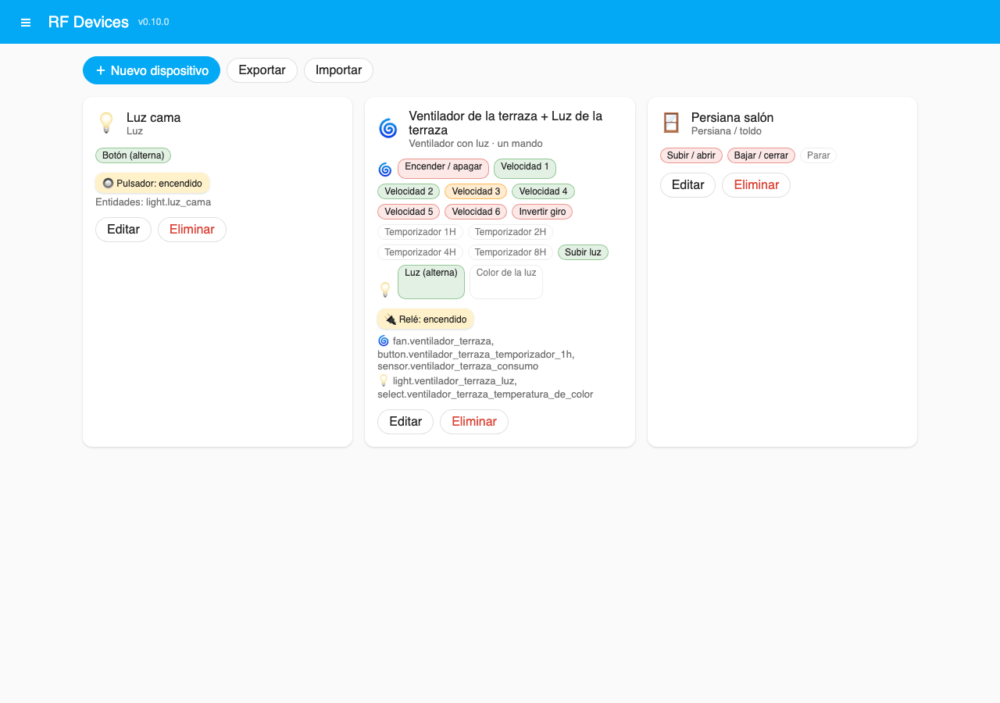
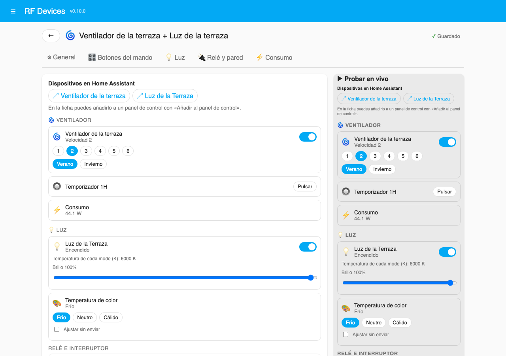
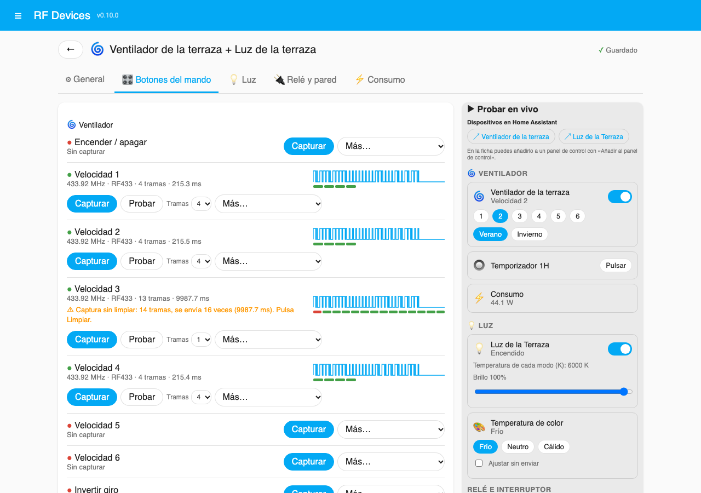
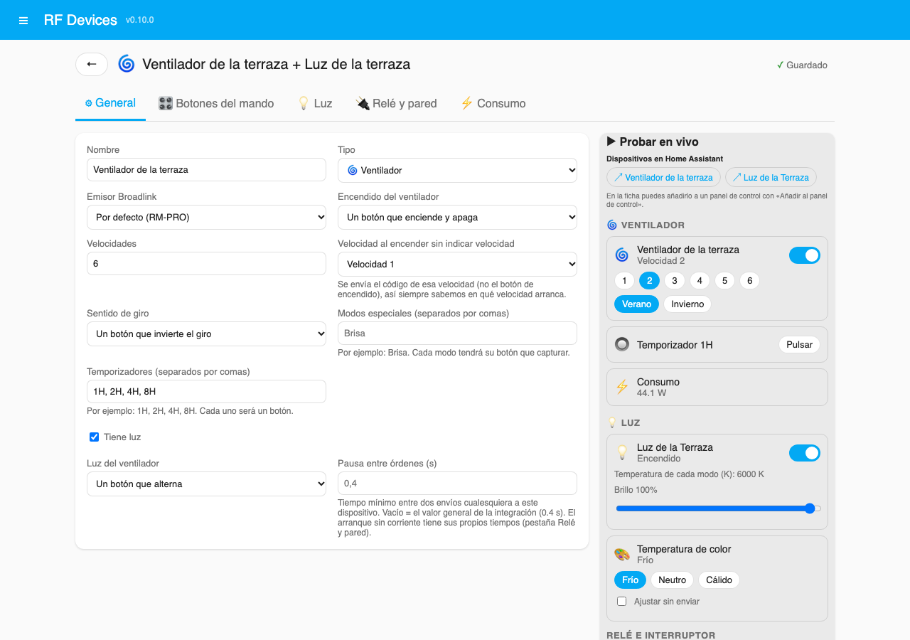
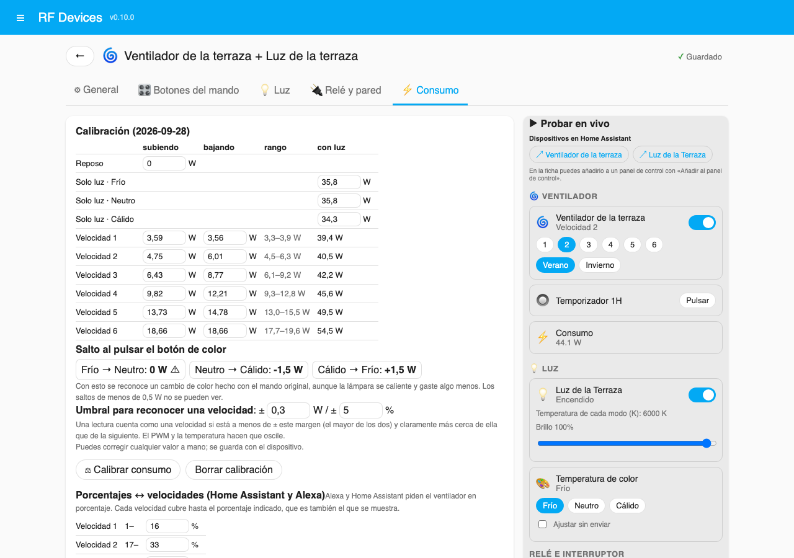
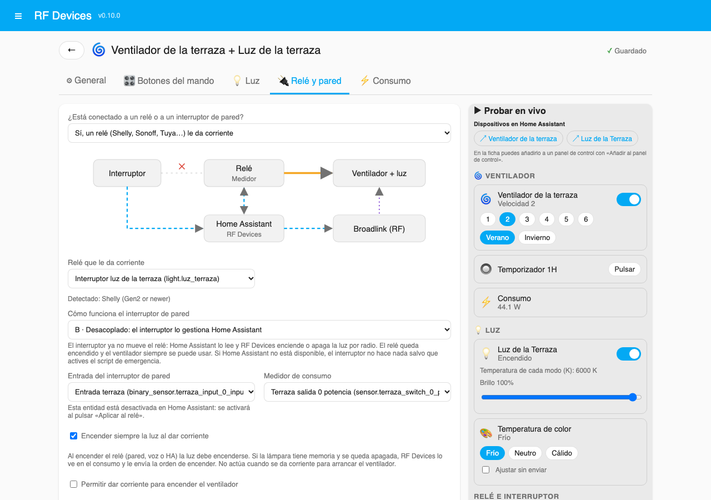

<p align="center">
  
</p>

<h1 align="center">RF Devices</h1>

<p align="center">
  Convierte los botones de cualquier mando RF en dispositivos reales de Home Assistant: luces,
  ventiladores, persianas, interruptores y botones, capturados y gestionados desde un panel visual.
</p>

<p align="center"><a href="https://my.home-assistant.io/redirect/hacs_repository/?owner=ma-ochoa&repository=rf_devices&category=integration"></a></p>

<p align="center"><a href="../README.md">English</a> · <b>Español</b></p>

---

## Qué te ofrece

Tienes un ventilador de techo, una lámpara o una persiana con **mando RF de 433/315 MHz**, y un
**Broadlink** capaz de emitir RF. RF Devices te permite:

- **Capturar cada botón desde un panel** en la barra lateral: sin YAML, sin
  `remote.learn_command` y sin buscar códigos en `.storage`.
- **Tener códigos limpios y fiables.** Cada captura se analiza y se reduce a unas pocas tramas
  idénticas que se envían una sola vez. Las lámparas de botón único ya no se encienden y se
  apagan al instante: es el típico "parpadeo" de los códigos RF aprendidos.
- **Crear entidades reales** que se comportan como deben:
  - un `fan` con velocidades, sentido de giro, modos especiales y temporizadores;
  - una `light` con modos de temperatura de color y regulación;
  - una `cover` con posición estimada;
  - entidades `switch` y `button`.

  Funcionan con paneles, automatizaciones y asistentes de voz (Alexa, Google, Assist).
- **Conocer el estado real** aunque se use el mando original. Puede salir de un medidor de consumo,
  de una entidad encendido/apagado o de una **calibración por consumo** que deduce la velocidad
  del ventilador y si la luz está encendida con un único medidor.
- **Usar el interruptor de pared y el relé inteligente** que alimentan el aparato: Shelly, y
  cualquier relé que Home Assistant pueda conmutar. Incluye **gestos en el interruptor**: un
  cambio alterna la luz, dos cambian la velocidad del ventilador, tres lo apagan…
- **Seguir funcionando con Home Assistant caído**: en Shelly, un script de emergencia opcional se
  encarga del interruptor si Home Assistant no confirma una pulsación.

<p align="center"></p>

## Hardware probado

| Función | Probado con | Debería funcionar también con |
|---|---|---|
| Emisor y aprendizaje RF | **Broadlink RM Pro+** (433 MHz) | Otros Broadlink con RF compatibles con la integración oficial (RM Pro, RM4 Pro…) |
| Emisor y aprendizaje RF (versión de prueba) | Aún sin probar con hardware real | **Mando RF433-IR de Athom / IoTorero** (ESP32, ESPHome, firmware 3.0.8 o posterior); cualquier `ir_rf_proxy` de ESPHome con emisor y receptor RF; cualquier entidad `radio_frequency` (solo enviar) |
| Relé, medidor e interruptor de pared | **Shelly Plus 2PM** (Gen2, RPC local) | Otros relés Shelly Gen2 o posteriores; cualquier relé o interruptor de HA mediante el adaptador genérico |

Solo se ha probado con los dispositivos de la primera columna, pero el código está preparado para
crecer:
- **Emisores**: se usan a través de adaptadores (`transmitters/`): una entidad `remote`
  (Broadlink) o una entidad `radio_frequency` (cualquier adaptador RF que admita Home Assistant,
  como ESPHome).
- **Relés**: se usan a través de adaptadores (`relays/`). Relés Sonoff, Tuya u otros módulos de
  interruptor y relé parecidos a Shelly pueden sumar funciones propias (consumo en directo,
  desacoplar el interruptor, scripts) añadiendo un único módulo.

## Requisitos

- Home Assistant **2026.5** o posterior (probado en 2026.9).
- Un emisor, uno de estos:
  - la integración oficial **Broadlink** con un modelo con RF. RF Devices emite a través de su
    entidad `remote` y usa su conexión para aprender;
  - un dispositivo **ESPHome** con la plataforma RF `ir_rf_proxy`, que da a Home Assistant una
    entidad `radio_frequency`. RF Devices envía por ella los tiempos de la trama y, si el
    dispositivo tiene también un receptor RF `ir_rf_proxy`, aprende con él (ver
    [Proxy RF de ESPHome](#proxy-rf-de-esphome-iotorero)).
- Opcional: un relé inteligente (por ejemplo, un Shelly) que alimente el aparato, con medidor de
  consumo e interruptor de pared.

## Instalación

### HACS (recomendado)

[](https://my.home-assistant.io/redirect/hacs_repository/?owner=ma-ochoa&repository=rf_devices&category=integration)

O a mano:

1. HACS → ⋮ → **Repositorios personalizados** → añade `https://github.com/ma-ochoa/rf_devices`,
   tipo **Integración**.
2. Busca **RF Devices**, instálala y **reinicia** Home Assistant.
3. **Ajustes → Dispositivos y servicios → Añadir integración → RF Devices** y elige tu mando
   Broadlink. Más adelante, desde **Configurar** puedes cambiarlo, fijar la pausa entre envíos y
   elegir el enchufe inteligente que alimenta el Broadlink (para reiniciarlo si se cuelga).

### Manual

Copia `custom_components/rf_devices` en `config/custom_components/` y reinicia Home Assistant.
Después añade la integración como en el paso 3.

Tras instalarla aparece **RF Devices** en la barra lateral (solo para administradores).

## Primeros pasos

1. Abre **RF Devices** → **Nuevo dispositivo**, ponle nombre y elige el tipo.
2. En la pestaña **Botones del mando**, pulsa **Capturar** en cada botón:
   - la primera vez, *mantén pulsado* el botón del mando hasta que se detecte la frecuencia y
     después púlsalo una vez;
   - cuando la frecuencia ya se conoce, basta con una pulsación.
3. Pulsa **Probar** para enviarlo. Si funciona, se guarda solo.
4. Las entidades aparecen en Home Assistant dentro de un dispositivo con ese nombre. La columna
   **Probar en vivo** permite usarlas al momento y enlaza con la ficha de cada dispositivo, donde
   está **Añadir al panel de control**.

<p align="center"></p>

<p align="center"></p>

## Tipos de dispositivo

| Tipo | Entidades | Botones del mando |
|---|---|---|
| **Luz** | `light` (encendido, modos de temperatura de color, brillo) | Un botón que alterna, o encender y apagar separados; botones opcionales de color y de más o menos brillo |
| **Interruptor** | `switch` | Alterno o encender/apagar |
| **Persiana** | `cover` con posición estimada | Subir, bajar y parar; tiempos de recorrido para posicionar |
| **Ventilador** | `fan` + `light` opcional | Encendido (alterno) o botón de apagado, de 1 a 10 velocidades, sentido de giro (un botón que invierte, o verano/invierno), modos especiales como *Brisa*, temporizadores y lámpara opcional con sus propios botones |
| **Botones** | Un `button` por botón del mando | Cualquiera |

Cualquier dispositivo puede tener además **botones extra** (`x_…`), que se convierten en
entidades `button`.

### Ventiladores con luz

Si la lámpara del ventilador tiene **nombre propio**, en Home Assistant son **dos dispositivos
independientes**, el ventilador y la luz, cada uno con su nombre y sus entidades. Los asistentes
de voz y los paneles los tratan por separado. En el panel de RF Devices siguen juntos, como un
único mando, con los botones y las entidades agrupados en *Ventilador* y *Luz*.

- **Velocidades y porcentajes**: cada velocidad tiene su porcentaje (tabla editable). Si "pon el
  ventilador al 2" llega como 2 %, se toma como la velocidad 2.
- **Encender** envía el código de una velocidad elegida (la 1 por defecto) y no el botón de
  encendido. Así el resultado es predecible, recuerde lo que recuerde el mando.
- **Temperatura de color**: pon nombre a los modos en el orden en que los recorre el botón.
  RF Devices recuerda el modo actual y te deja elegir qué hace la lámpara al volver la corriente:
  mantener su modo, empezar siempre en uno o avanzar al siguiente.
- **Brillo**: los botones de más y menos brillo se mantienen pulsados el tiempo necesario.

<p align="center"></p>

## Conocer el estado real

La RF solo va en un sentido: Home Assistant supone el estado. RF Devices tiene varias formas de
mantenerlo correcto:

- **Entidad de estado**: un sensor de consumo (W, con un umbral) o cualquier entidad
  encendido/apagado. El estado la sigue.
- **Calibración por consumo** (ventiladores con luz en un único medidor): un asistente mide el
  reposo, la lámpara en cada modo de color y cada velocidad **subiendo** y **bajando**, porque
  los motores PWM consumen distinto. Después, el alineador lee el medidor y corrige velocidad,
  luz y color sin transmitir, incluso tras usar el mando original. Los valores se pueden editar a
  mano.
  - **Calibración en vivo** (medidores en directo, activada por defecto): tras cada orden de
    velocidad de RF Devices, con la luz apagada, se vigila el consumo hasta 15 min y, cuando está
    realmente estable (un motor PWM puede seguir subiendo durante minutos), se corrige el valor de
    esa velocidad. Si la lectura parece de otra velocidad (se usó el mando entretanto), se ignora.
  - Sensor **Velocidad estimada**: posición del motor entre las velocidades calibradas, en %, con
    el atributo `trend` (acelerando / frenando / estable) mientras cambia.
- **Calibración en vivo**: tras cada orden de velocidad propia, el consumo estable corrige esa
  velocidad. Cada encendido o apagado de la lámpara con el ventilador parado corrige el valor de la
  lámpara, que cambia con la temperatura. La tabla se mantiene al día sin volver a calibrar.
- **Calibración rápida de la luz** (1–2 minutos, ventilador parado): mide solo la lámpara. Basta
  para distinguir la luz del ventilador por sus saltos de consumo, sin esperar a cada velocidad.
- **Botones de sincronizar** y los servicios `rf_devices.set_state`,
  `rf_devices.set_position_state` y `rf_devices.set_color_mode` corrigen el estado sin enviar
  nada.

Con un medidor Shelly (Gen1 o Gen2 y posteriores), el consumo se lee **en directo** por su API local.
Home Assistant solo recibe de él saltos de ~1 W, demasiado gruesos para distinguir las velocidades
de un ventilador.

<p align="center"></p>

## Relé e interruptor de pared

Muchos ventiladores y lámparas se alimentan de un relé inteligente que mueve un interruptor de
pared. Se configuran en la pestaña **Relé y pared**; un diagrama muestra el cableado del modo
elegido.

| Modo | Interruptor de pared | Qué hace RF Devices |
|---|---|---|
| **Ninguno** | — | Solo RF |
| **A · Acoplado** | Mueve el relé directamente | Sigue al relé (relé encendido = luz encendida). Si pides la luz con el relé apagado, enciende el relé. |
| **B · Desacoplado** | Solo informa a Home Assistant | Alterna la luz **por RF**. El relé queda encendido y el ventilador siempre tiene corriente. Admite gestos y script de emergencia. |
| **Solo interruptor de pared** | Entrada desacoplada sin nada en su salida | Lee el interruptor; el aparato siempre tiene corriente. Admite gestos. |

Opciones:

- **Aplicar al relé** (Shelly): desacopla o vuelve a acoplar el interruptor en el propio
  dispositivo, activa su entidad de entrada e instala o quita el script de emergencia. Al volver
  al modo A se deshace todo.
- **Encender siempre la luz al dar corriente**: si la lámpara recuerda "apagada", RF Devices lo
  ve en el consumo y envía "encender".
- **Dar corriente para arrancar el ventilador**: hay que activarlo expresamente, porque la luz se
  enciende un momento. Mejor desactivado en dormitorios. Los tiempos del arranque son
  configurables.
- **Apagar el relé tras N minutos con todo apagado** (siempre, de noche o en una franja horaria):
  un relé con corriente durante años puede soldar sus contactos.
- **Usar el nombre y el entity_id del relé**: la luz RF adopta el nombre y el `entity_id` que tu
  asistente de voz ya conoce, y el relé pasa a llamarse "Interruptor …". Reversible.
- **Ocultar las entidades del propio relé** para que solo se vean la luz y el ventilador RF.

<p align="center"></p>

### Gestos del interruptor (modo B y solo interruptor de pared)

Un interruptor de palanca solo informa de que ha cambiado, así que RF Devices cuenta los cambios
rápidos. Cada número de cambios tiene la acción que elijas:

| Cambios | Ejemplo de acción |
|---|---|
| 1 | Alternar la luz |
| 2 (una ida y vuelta rápida) | Encender el ventilador, o subir una velocidad; desde la máxima, vuelve a bajar |
| 3 | Apagar el ventilador |
| 4 o más | Apagar el ventilador, u otra acción |

Acciones disponibles:
- **Luz**: alternar, encender, apagar y siguiente color.
- **Ventilador**: subir velocidad (y bajar al llegar a la máxima), más rápido, más lento,
  encender, apagar, alternar y cambiar el sentido de giro.
- **Generales**: apagar todo, cortar el relé o nada.

- La **ventana** entre cambios es configurable (0,6 s por defecto). Si solo hay acción para
  1 cambio, la luz responde al instante; si no, espera a que pase la ventana.
- Cada gesto se publica también como el evento `rf_devices_wall_gesture` con `device_id`, `name`,
  `flips` y `action`, para tus propias automatizaciones.

### Script de emergencia (Shelly, modo B)

Con el interruptor desacoplado, la pared depende de Home Assistant. El script opcional la
mantiene funcionando si Home Assistant cae:

- Home Assistant confirma **cada** cambio al Shelly en cuanto lo recibe (~0,1–0,3 s).
- Si la confirmación no llega dentro de la espera (1–2 s, configurable), el script conmuta el
  relé él mismo, como un interruptor normal.
- No envía nada en reposo ni escribe en la memoria flash. Ocupa unos 0,5 KB de la memoria del
  Shelly.

## Protecciones del Broadlink

Para aprender, el Broadlink entra en un modo especial, y algunas unidades se cuelgan si se les
pregunta demasiado deprisa. RF Devices:
- comprueba que el Broadlink responde antes de aprender;
- le pregunta una vez por segundo;
- siempre le hace salir del modo de aprendizaje;
- no envía nada durante una captura;
- lo comprueba al terminar.

Si deja de responder, recibes un aviso. Con un enchufe inteligente configurado, RF Devices puede
reiniciarlo. Todos los envíos pasan por una cola con una pausa configurable, también por
dispositivo.

## Proxy RF de ESPHome (IoTorero)

Versión de prueba: todavía no se ha probado con hardware real. Se agradecen los comentarios en
las incidencias.

1. Añade el dispositivo con la integración ESPHome. En el mando RF433-IR de Athom / IoTorero,
   actualízalo al firmware **3.0.8 o posterior** desde su entidad *Firmware Update*: ese firmware
   ya declara el emisor y el receptor RF de `ir_rf_proxy`. Con tu propia configuración de ESPHome:
   ```yaml
   radio_frequency:
     - platform: ir_rf_proxy
       name: 433MHz RF Transmitter
       frequency: 433.92MHz
       remote_transmitter_id: rf_transmitter
     - platform: ir_rf_proxy
       name: 433MHz RF Receiver
       frequency: 433.92MHz
       remote_receiver_id: rf_receiver
   ```
2. Elige la entidad `radio_frequency.…_433mhz_rf_transmitter` como emisor (en las opciones de RF
   Devices o en cada dispositivo).
3. Captura: no hay barrido de frecuencia. Pulsa el botón una vez y mantenlo alrededor de un
   segundo. Se juntan las ráfagas del receptor, se descarta el ruido y el resultado se limpia
   igual que una captura del Broadlink.

Los códigos se siguen guardando en formato Broadlink, así que pueden pasarse de un Broadlink a
un emisor ESPHome y al revés. Con estos receptores solo funcionan mandos de código fijo a
433,92 MHz con modulación OOK (no los de código variable). Con los registros de depuración
activados se anota cada ráfaga recibida: adjúntalos a una incidencia si una captura falla.

## Importar, exportar y códigos existentes

- **Exportar e importar** todos los dispositivos (o algunos) en un JSON para llevarlos a otra
  instalación. Los datos están en `.storage/rf_devices` y entran en las copias de seguridad de
  Home Assistant.
- **Reutilizar códigos** aprendidos con la integración Broadlink oficial: *Más… → Desde
  Broadlink* en cualquier botón. También puedes pegar un código o copiarlo de otro dispositivo de
  RF Devices.

## Servicios y eventos

| Servicio | Qué hace |
|---|---|
| `rf_devices.set_state` | Fija encendido/apagado (y el porcentaje del ventilador) sin transmitir |
| `rf_devices.set_position_state` | Fija la posición de una persiana sin transmitir |
| `rf_devices.set_color_mode` | Fija el modo de color recordado sin transmitir |

| Evento | Datos |
|---|---|
| `rf_devices_wall_gesture` | `device_id`, `name`, `flips`, `action` |

## Resolución de problemas

- **Diagnósticos**: el botón *Diagnóstico* del panel (o *Ajustes → Dispositivos y servicios →
  RF Devices → ⋮ → Descargar diagnósticos*) descarga un informe con versiones, emisores,
  dispositivos ESPHome con RF/IR, entidades usadas, últimos envíos y capturas (con las ráfagas
  recibidas) y las últimas líneas del registro. Los códigos guardados van resumidos, no
  incluidos. Adjúntalo a la incidencia.
- **Registros de depuración**:
  ```yaml
  logger:
    logs:
      custom_components.rf_devices: debug
  ```
- **Un código funciona a veces o la lámpara parpadea**: abre el botón, revisa el mapa de tramas y
  usa *Limpiar*. Elige más o menos tramas si el receptor las necesita.
- **El estado del ventilador se desvía**: repite la calibración. Las lámparas cambian su consumo
  al calentarse.
- **El script conmutó el relé con Home Assistant funcionando**: aumenta su espera.
  `Switch.GetStatus` del Shelly muestra `"source": "loopback"` cuando actuó el script.

## Limitaciones

- De momento solo RF de 315/433 MHz (sin IR).
- El estado se supone si no hay medidor ni entidad de estado vinculados.
- Los Shelly con contraseña solo se usan a través de sus entidades de Home Assistant: sin consumo
  en directo, sin desacoplar y sin script.
- Solo se ha probado con el hardware indicado arriba.

## Ampliar: otros emisores

Los emisores están en `custom_components/rf_devices/transmitters/`. Crea una subclase de
`Transmitter` (`base.py`), implementa `async_send` y, si puede aprender, `learn_problem` y
`async_learn`, y asocia su dominio de entidad en `TRANSMITTERS` (`__init__.py`).

## Ampliar: otros relés

La compatibilidad con relés está en `custom_components/rf_devices/relays/`. Cualquier relé que
Home Assistant pueda conmutar funciona con `generic.py`. Para añadir funciones de un fabricante:

1. Crea un módulo con una subclase de `RelayAdapter` (`relays/base.py`).
2. Declara lo que sabe hacer en `capabilities` e implementa esos métodos: consumo en directo,
   desacoplar, script de emergencia y confirmación.
3. Añádelo a `ADAPTERS` en `relays/__init__.py`.

`relays/shelly.py` es un ejemplo completo. Las contribuciones son bienvenidas.

## Licencia

[MIT](../LICENSE)
